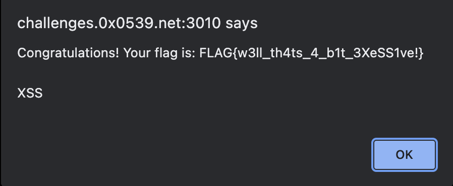

# Challenge 3: Excessive Alert (15 Points)

Welcome to the captivating challenge titled "Excessive Alert"! 

## Challenge Description

- **Difficulty:** Basic
- **Points:** 15

Your task involves interacting with a website featuring a seemingly ordinary search form. The key lies in identifying and exploiting a Cross-Site Scripting (XSS) vulnerability.


## Instructions

1. Visit the designated website, focusing on the search form.
   

2. Given the challenge's name, "Excessive Alert," it suggests the presence of a XSS vulnerability.

3. Perform a basic XSS test by injecting the following script into the search form:
   ```html
   <script>alert("XSS");</script>
4. An alert will pop holding the key:
   

5. Final answear: FLAG{w3ll_th4ts_4_b1t_3XeSS1ve!}

