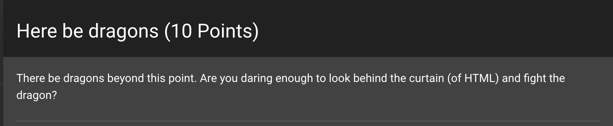
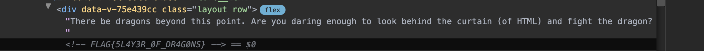

# Challenge 1: Here be Dragons (10 Points)

Welcome to the first challenge! This one is designed to be a relatively easy entry point.

## Challenge Description

- **Difficulty:** Easy
- **Points:** 10

Your mission is to find the hidden flag using your browser's developer tools.



## Instructions

1. Open your browser's developer tools (you can usually do this by right-clicking on the page and selecting "Inspect" or "Inspect Element").

2. Use the element select tool to grab the element containing "Here be dragons (10 Points)".

3. Expand the selected div and explore its contents.



## Solution

The flag is hidden in an HTML comment within the expanded section of the selected element.

```html
<!-- FLAG{5L4Y3R_0F_DR4G0NS} -->