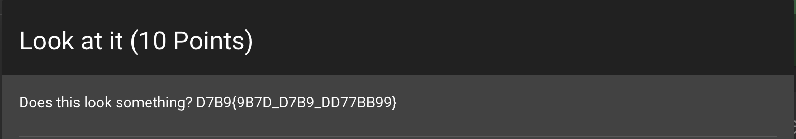

# Challenge 1: Look At It (10 Points)

Welcome to the second challenge! Despite its initial simplicity, this challenge requires careful observation to unravel its secrets.

## Challenge Description

- **Difficulty:** Easy
- **Points:** 10

Your mission is to decode the string "D7B9{9B7D_D7B9_DD77BB99}" and reveal the hidden flag.

## Instructions

1. Assume that the provided string follows the format `FLAG{9B7D_D7B9_DD77BB99}`.

2. Establish a mapping table based on the assumption:
   - D = F
   - 7 = L
   - B = A
   - 9 = G

3. Apply the substitutions to decode the original string:
   - Replace D with F
   - Replace 7 with L
   - Replace B with A
   - Replace 9 with G

4. The decoded string is now "FLAG{GALF_FLAG_FFLLAAGG}."

5. This is your final answer.

